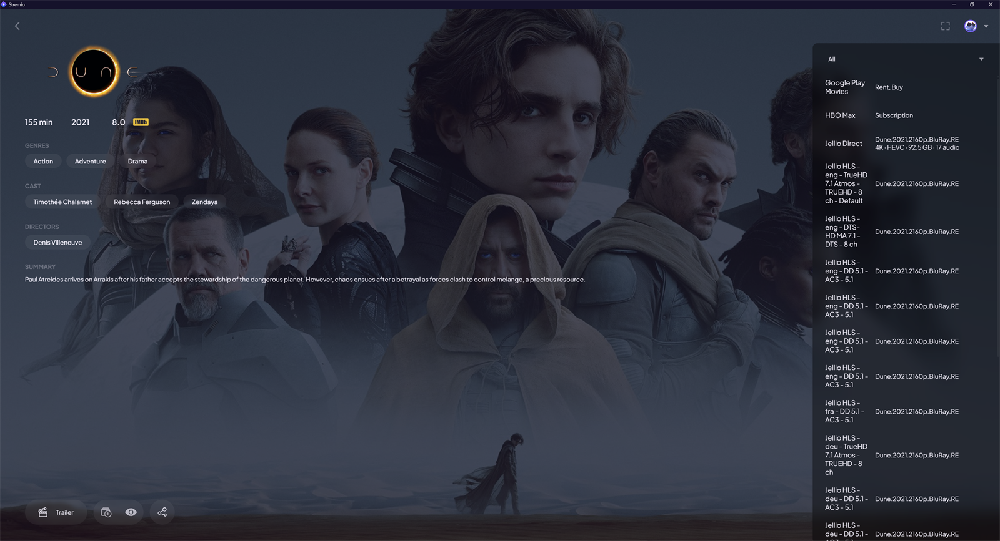

# Jellio Direct (unofficial, temporary)

> **This is a temporary build.** It exists only until direct play lands in
> [Jellio++](https://github.com/wujekbogdan/jellio-plus-plus) itself
> ([#14](https://github.com/wujekbogdan/jellio-plus-plus/pull/14)). Once that is
> released, switch back to Jellio++; this build won't be maintained after that.
>
> It is based on the older Jellio+++ code by hexSB, not on the current Jellio++,
> and was made with AI help.

**What it adds**

- A **Direct** entry at the top of the stream list, which plays the original file
  (`/Videos/{id}/stream?static=true`): lossless audio (TrueHD, DTS-HD MA), image
  subtitles (PGS) and embedded tracks are kept, and Jellyfin doesn't transcode.
  The HLS entries stay below it as a fallback.
- Logo and background images in catalog items, and descriptions as plain text.

**Installing**

1. Download the zip from [Releases](https://github.com/CXZP/jellio-plus-plus-plus/releases).
2. Extract it into a new folder in Jellyfin's `plugins` directory
   (for example `C:\ProgramData\Jellyfin\Server\plugins\JellioDirect`).
3. Restart Jellyfin, then open **Dashboard → Plugins → Jellio Direct** to configure it
   and install the addon in Stremio.

It uses its own plugin ID, addon ID and URLs (`/jelliodirect/...`), so it can be
installed next to the official Jellio++ without the two overwriting each other.
Requires Jellyfin 12.

**Good to know**

- The plugin page in Jellyfin's dashboard shows *"An error occurred while getting
  the plugin details from the repository."* That's expected: the plugin isn't in
  any plugin repository, so Jellyfin has nothing to look up. It works normally.
- If you keep both addons installed in Stremio (this one and Jellio++), every
  catalog and every stream shows up twice. Install only one of them in Stremio,
  or remove the other one there.
- In the stream list, **Jellio Direct** is the original file; the
  **Jellio HLS** entries are the fallback, one per audio track.

---

# Jellio+++
[](https://github.com/hexSB/jellio-plus-plus-plus/releases)

Stream your Jellyfin library directly in Stremio with seamless integration.

**Jellio+++** is a fork of a fork:

- [**Jellio**](https://github.com/vanchaxy/jellio) by [Vanchaxy](https://github.com/vanchaxy) - the original Jellyfin↔Stremio bridge.
- [**Jellio+**](https://github.com/InfiniteAvenger/jellio-plus) by [InfiniteAvenger](https://github.com/InfiniteAvenger) - fork adding Jellyfin 10.11.x support.
- [**Jellio++**](https://github.com/wujekbogdan/jellio-plus-plus) by [wujekbogdan](https://github.com/wujekbogdan) - adds HLS streaming, OpenSubtitles hashes, and public base URL support.
- **Jellio+++** - this fork. Rewritten plugin UI, transcoding controls, subtitle support, and Jellyfin 12 compatibility.

Every fork gets another `+`. We don't make the rules.

## Features

- **Full Library Integration** - Access your entire Jellyfin movie and TV show collection in Stremio
- **Cross-Platform** - Works on all Stremio-supported devices (Windows, macOS, Linux, Android, iOS)
- **HLS Streaming** - Adaptive bitrate streaming with proper seeking via `master.m3u8`
- **Transcoding Controls** - Choose adaptive, forced, or disabled transcoding separately for video and audio
- **Subtitle Support** - Text subtitles (SRT, ASS, VTT) served from Jellyfin; OpenSubtitles hash for automatic subtitle matching
- **Audio Track Selection** - Pick specific audio tracks (language, codec, channels) directly in Stremio
- **AV1 Compatibility** - Adaptive video mode direct streams 1080p AV1 and transcodes 4K AV1 to H.264 for smoother Stremio playback
- **Public Base URL** - Override the server URL for HTTPS connectivity behind reverse proxies or tunnels
- **Jellyseerr Integration** - Request missing content directly from Stremio
- **Logs Viewer** - In-app streaming logs with auto-refresh for debugging
- **Modern UI** - React-based configuration interface with dark mode support

## How it Works

### Browsing Your Library in Stremio

Jellio+++ allows you to instantly stream media from your Jellyfin server through Stremio. Simply search for the media in Stremio, and if it is on your Jellyfin server, it will appear!



### Jellyseerr Integration

Enable the optional Jellyseerr functionality to be able to directly request media to be sent to Jellyseerr with a simple in-app solution.


### Installation

NOTICE: Your Jellyfin instance needs to be reachable over HTTPS because Stremio requires HTTPS for addon URLs. You need an HTTPS tunnel such as Cloudflare Tunnel, Tailscale Funnel, ngrok, etc.

1. Open Jellyfin Dashboard > Plugins > Manage Repositories
2. Click "New Repository" and add "Jellio+++" for the name, and "https://raw.githubusercontent.com/hexSB/jellio-plus-plus-plus/metadata/jellyfin-repo-manifest.json" for the repository url
3. Go back to Plugins, and under "All" find and install Jellio+++
4. Restart Jellyfin
5. Jellyfin Dashboard > Plugins > Installed > Jellio+++ and then click "Settings"
6. Select which libraries you want to be included in Stremio
7. (Optional) Input your local Jellyseerr url (e.g. http://192.168.0.105:5055) and your Jellyseerr API key. Also include your Public URL for Jellyfin (e.g. https://jellyfin.yourserver.com)
8. Click "Save Configuration for Jellyfin"
9. Lastly, click "Install." Copy that link and paste it in your Stremio addons. You're all done!

## Configuration

### Transcoding Settings

- **Video Transcoding Mode** (default: Adaptive) - Adaptive copies AV1 up to 1080p, HEVC, and H.264 when supported and transcodes unsupported video; Force Transcode always re-encodes to H.264; No Transcode never requests video transcoding
- **Audio Transcoding Mode** (default: Adaptive) - Adaptive copies Opus/EAC3/AAC when supported and transcodes unsupported audio; Force Transcode always re-encodes to AAC; No Transcode never requests audio transcoding
- **Max Video Bitrate** - Maximum video bitrate in Mbps (10-200, default: 120)

### Public Base URL

If your Jellyfin server is behind a reverse proxy, Cloudflare Tunnel, or Tailscale Funnel, set the public HTTPS URL here so Stremio can reach it.

## Development

### Backend stack

Build the plugin and start Jellyfin + Stremio:

```bash
docker compose run --rm dotnet-builder
docker compose up -d
```

Jellyfin: http://localhost:8096. Stremio: http://localhost:11470. Test media goes in `./media/`.

### Plugin UI

```bash
cd jellio-web
npm install
npm run dev
```

Served at http://localhost:5173/jelliopp/. All API calls are mocked with MSW; the UI does not connect to any backend.

## Requirements

- Jellyfin 12.0.0+
- Stremio (any platform)
- HTTPS access to Jellyfin (required by Stremio)
